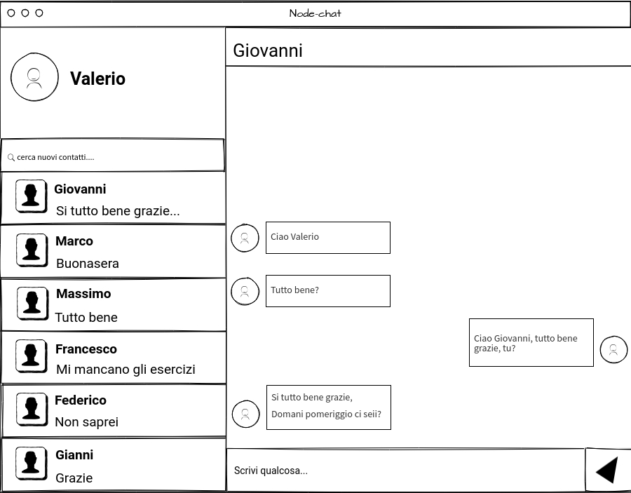

# Node-chat
Web live chat for the university course "Tecnologies and Languages for Web"

## Introduction
After registering, a user can start chatting with their friends / acquaintances knowing their username (specifically chosen during the registration phase). To speed up the execution speed I decided not to rely on client-side frameworks (eg: jquery, angular, etc.), but I created all the code with native javascript, through the Model View Controller pattern with the standard ECMAScript 6 specification. As for the server I used Node.js with the Express framework. as a DBMS I used Postgresql, with the 'pg-promise' library to interface with it.



## Installation
```sh
docker build -t node-chat .
docker run -p3000:3000 node-chat
```

## Usage
open any browsers and type localhost:3000